# CHRONICLES OF TECHNOLOGY SECTOR
Time Series Analysis of S&P 500 stocks to understand patterns of investments with deeper understanding of historical events and stock price analysis.

## Market capitalization (US $billion)(as of 2019)
The U.S. leads the global landscape in technology innovation. The country’s competitive edge, according to the World Economic Forum’s 2018 Global Competitive Index, is due to its business dynamism, strong institutional pillars, financing mechanisms, and vibrant innovation ecosystem.
The purpose of the project analysis is to understand the impact of several crisis that the country has faced across the years over the IT industry.
This analysis is performed with the help of historical data obtained from S&P 500 Companies data obtained from Yahoo Finance package that provides stock prices for companies as well as aggregated industry sectors till date.
So, it is useful to analyze S&P500 because they are representative of the industries in the United States economy. People always want to know how the market performance is and how to predict its return. 
To move ahead in the study, let’s understand the current market condition in the US. 

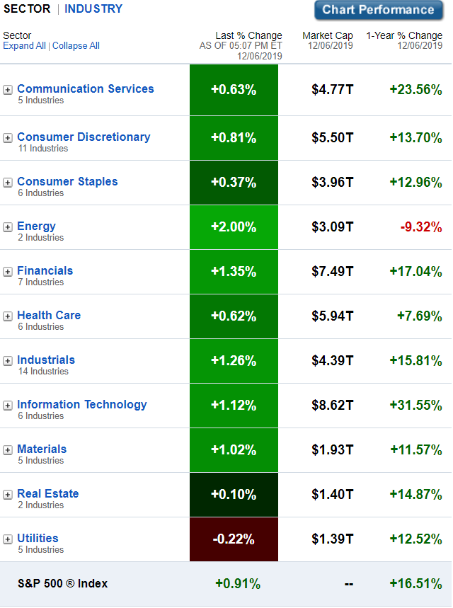

As observed from the above table, IT sector contributes to $8.62T of the market capitalization that is much higher than even the Financial sector market cap. 
To understand deeper and know what influences the IT business the most, we look in the sub-classifications of the industry-

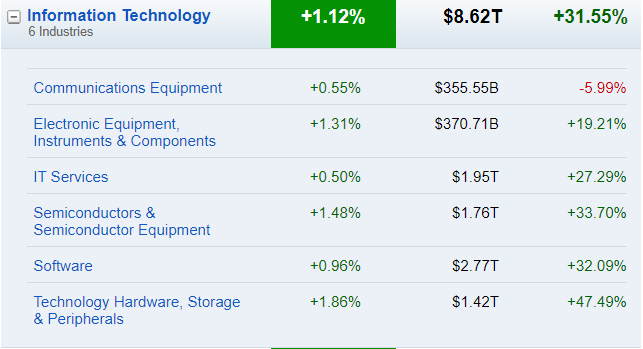

So, the above figure, reveals that companies working in Software industry and IT Services industry are the biggest contributors towards the overall IT sector capitalization. And thus, their stories across good times and bad times can be a huge lesson learning for potential and serious investors, looking to invest their share in the companies of IT industry.

## Goal
As part of this project, we’ll be looking at a few notable landmarks of the struggle of IT industry and their stock price stories to understand the impact of investor sentiments and market trends.
** Some Notable Landmarks in the History of IT Industry**
1.	Dot-Com Bubble
2.	Housing Bubble
3.	Cryptocurrency Bubble
4.	Impact of Start-Up Competitors

Moving further we’ll examine some common techniques used in time series analysis by applying them to a data set containing daily closing values for the S&P 500 stock market index from 2009 up to present day. The objective is to explore some of the basic ideas and concepts from time series analysis, and observe their effects when applied to a real-world data set. Although it’s not possible to actually predict changes in the index using these techniques, the ideas presented here could theoretically be used as part of a larger strategy involving many additional variables to conduct a regression or machine learning effort.

## Dot-Com Bubble
In today’s world of ubiquitous connectivity and seamless experience, it is hard to imagine that the internet and its many applications once had difficulty cultivating a network of users. But in the mid-1990s, internet still had only minimal uses and yet, anything.com’s began popping up everywhere. Putting “dot com” in your company name was enough to land you a golden ticket to IPO stardom; not to mention a few hundred million.

Pets.com, Webvan, the examples are endless. Stars who burned too bright and then died. The speculation grew too fast. It outgrew its fundamental value: it’s users. The speculation of what it could be was suddenly replaced by the realization of what it was. In the long run, speculation led to overvaluation that destroyed many companies. Companies need a reality check; they need pressure and obstacles — a $500 million valuation directly after IPO does not lead to success.

To illustrate this uncanny investor appetite for a piece of the Dot.com bubble, in 1995, the NASDAQ index was worth just under 1,000 points. Just five years later at the peak of the bubble, this figure had increased five-fold to its then all-time of 5,132. What was to follow was an ultra-fast transition from “Buy, Buy, Buy” to that of a “Panic Sell, Panic Sell, Panic Sell”.
Only 50% of dot-coms survived the pop, as a graveyard of startups lined Wall Street and Silicon Valley

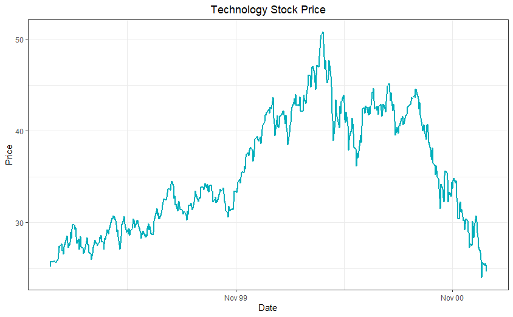

Notice the rising trend of the chart with consistent peaks in ’99 and then the industry had a trail of downfall from early 2000 that continued all year following the trend in 2001 and even 2002. In just 3 years, the industry saw a stock movement of golden days to the darkest valleys of bankruptcy, IPO cancellations and companies going out of business.
To understand the overall market conditions during the period, we look at the stock performance of other industries like energy and finance during the same time.
These aggregated stock results can be easily obtained from the S&P 500 package using the industry codes provided from the list. Notice, the code for technology sector, the company code is- “XLK”. Similarly, for energy sector= “XLE” and for finance sector= “XLF”. 

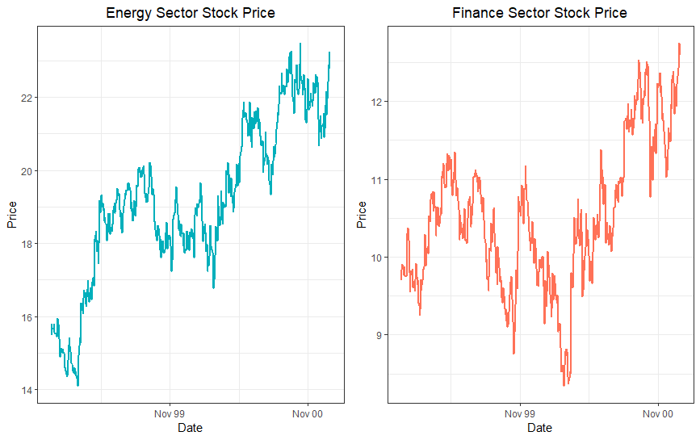

Comparing the stock charts of Technology sector to those of Energy sector and Finance sector, it is observed that, the stock movements of Technology sector had no influence from other industry performance or global politics. 
Although the energy sector is considered most vulnerable to the country’s political and economic volatility, it was still at a better position, compared to that of the Technology sector. So, what was driving the volatility of the IT industry then?

### What went wrong?
The biggest bubbles always occur when the potential for disruption is enormous. To picturize a cohesive explanation of the rise, persistence and then subsequent fall of the internet stock prices, let’s consider a company.
Let’s rewind the clocks 22 years. It’s 1999 and you are a savvy investor, passionate about the internet revolution. The 6 biggest tech companies are valued at $1.65 trillion, 20% of the US’s GDP, yet you’re still constantly laughed at by your friends for investing in the new “fax machine.” Imbeciles. You know that if you do your due diligence you will find golden dot-com companies to invest in. One day one pops up on your radar. It checks all your boxes: strong team (the two founders of Borders books) and powerful institutional backing (Sequoia Capital and Benchmark Capital — later Goldman Sachs). The company is WebVan, an online grocer that promised 30 minute deliveries. In their ICO in 1999, they would raise $375 million before quickly exploding to $1.2 billion. Bullish? Disruptive? Sound familiar? Yet in July of 2001, the stock price dropped from $30 to 6 cents and WebVan lost $700 million in a day.
But during the same time, IT popularity grew further, there were giants as well as established companies that attracted low risk investors. These investors made a choice to invest in these reputed or say traditional companies with the surety that the train was solid and that it was safer to ride along. But was it?
Unfortunately, the poorly managed like Pets.com, WebVan, Priceline.com were not the only ones to suffer. Everyone plunged from Apple, IBM, eBay, Amazon, Oracle, NVIDIA and everyone.   
Let’s look at how other companies swayed the trend. The technology sector was driven by a lot of product verticals like software producing companies, goods manufacturing companies like mobile devices, semiconductors, printers, etc. and service providing companies like Amazon, eBay, etc. Inorder, to draw a complete picture we consider companies from each vertical.

### Goods Producing Company-
Who doesn’t know Apple? It was probably the first company that came into your mind. Be it a good market or a bad phase, one would expect that Apple was not a kind of company that could get largely affected by the winds. But the charts speak a different story-

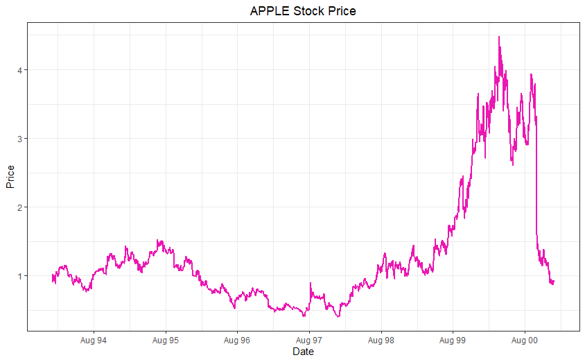

Notice, a steep plunge in the stock price by August 1999 and then within exactly one year, the stock price of Apple decimated from $4.5 to $0.8. The investors lost a lot on stake.
But Apple wasn’t the only one. It was nearly the same story for every goods manufacturing industry.

### Software Making Companies-
Companies like Oracle had huge hits from the wave too. 

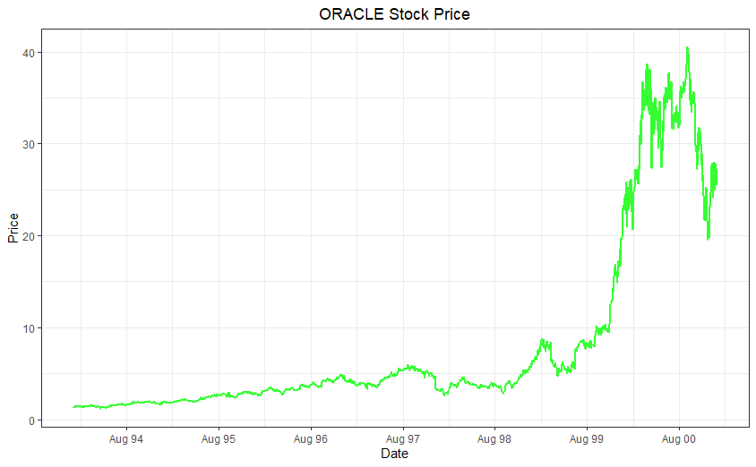

As you can see Oracle’s stock price peaked in late 2000 at a price of $46.47. And the Dot-Com bubble hit it harder. The stock price reached as low as just $7.25 in the summer of 2002. And these valleys were not momentary. The traces of loss stay for a very long time. The steeper the fall, the tougher it gets to get back to the original point. It took Oracle almost 14months to recovery when eventually the stock reached it previous all-time high in December 2014.

### Service Providing Companies-
Amazon was regarded as competitor of WebVan. So, Amazon and any “.com” crashed even more dramatically. From $85.06 in 1999 to $5.97 by 2001. It wasn’t until October 2009 that it managed to surprise this value- a mere 10 years.

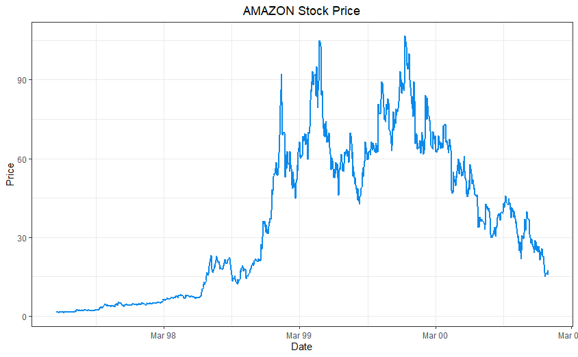

### Housing Bubble
The story of the crisis in a nutshell-

The current financial crisis began when the American Dream of home ownership was planted in the hearts of millions, even those that didn’t have the fiscal discipline or financial wherewithal to be homeowners.

To combat the economic aftermath of 9/11, the Federal Reserve lowered interest rates. Greenspan & Company badly miscalculated by keeping rates too low for too long.

Home prices rose anyway, reinforcing the American dream.
Artificially low interest rates created cheap mortgages which created a speculative boom in real estate.

Aggressive mortgage brokers capitalized by selling doomed subprime mortgages to unqualified borrowers. Despite a fundamental breakdown of lending standards and regulatory oversight, no one noticed. Banks and brokers collected billions.

Home prices continued to soar. From 2002 to 2007, the S&P/Case-Shiller Home Price Index of 20 metropolitan cities outpaced the stock market and jumped by 75 percent. Inflated real estate lured consumers, homebuilders and investors into a false sense of financial security.
Consumers continued to binge on real estate and home equity lines.

Instead of holding mortgages and collecting the interest on the yield from the loans, lenders pooled them into securitized burritos. The packaged loans were sold with the help of inflated ratings from Standard & Poor’s and Moody’s.

Wall Street’s underwriters collected billions in fees and rating agencies got their cut. Earnings and profits rose, but executive compensation rose faster.
Investment banks like Bear Stearns and Lehman Brothers devolved into highly leveraged hedge fund-like entities. Both firms collapsed.

By now, the housing bubble was growing up to be one of the biggest financial crises of The United States. And the flashes reflected across the global economy.

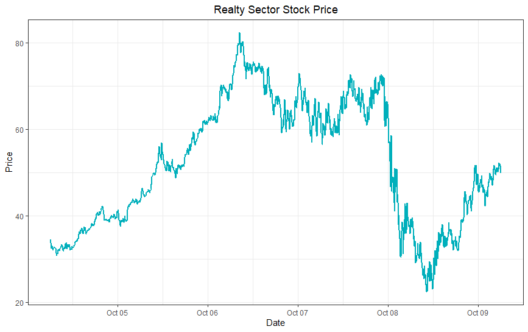

Let’s evaluate the pattern of the trendline here. It slowly started increasing from 2004 until it reached an all time high in early 2007 and then stayed level until September 2008 before it plummeted in almost a straight line. 

This event let to a nationwide recession and repulsed to impacting other industries too. 

Mutual funds, hedge funds and other financial institutions that overdosed on risky mortgage securities that were once deemed safe began to falter. Ailing mortgage borrowers set off a tsunami of defaults, which triggered a collapse in the value of mortgage-backed securities. Financial institutions were forced to write down more than $1 trillion from their balance sheets.

Other opaque financial instruments like auction rate securities and credit default swaps blew up.
Home foreclosures accelerated, which created a glut of residential real estate pushing home prices down further.
Financial giants like AIG, Freddie Mac, Fannie Mae, IndyMac, Lehman Brothers and Washington Mutual collapsed. Others followed. Home prices crumbled even further.
Financial stocks within the S&P 500 fell by 45 percent.

Banks and financial institutions fought for survival by hoarding cash. They stopped lending to their clients and to each other.
Without cash flowing from banks, businesses couldn’t carry on their daily operations, much less grow.
Liquidity in the financial system dried up. Probably that is the correlation that is reflected in the trend patterns of both Financial sector as well as Technology sector stock prices.

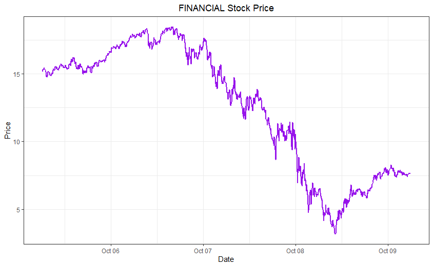

Starting from October 2008 to October 2009, notice the steepness and the severity of impact on the stock market as a whole as well as on the Technology sector. 

## Introduction of Startup Competitors-
In this surge of finding a unique space in the internet business, investors started realizing the potential of returns from start-up investments to rushing IPOs and there it started a start-up race. Everyone had new ideas and every garage was a potential place of innovation. Especially, the 2000’s era. One lead to the other and the growth of start-ups made hallways of war through IPO.

Snap.Inc parent of Snapchat considered itself a competitor of Facebook and Twitter minted plenty of new millionaires — and billionaires — as the company’s stock soared 44 percent in its first day as a public company affecting the business of Facebook by a dip of 10%.

But the battle never ended there, Snap shares fell as much as 7% after Facebook announced the launch of Threads, a new messaging app for Instagram users. Posing a comeback from the setback, this new feature was the biggest USP of Snapchat. The stock price of Snapchat plummeted ever since reaching a low of $3.5 in 2017

The stories are endless and so are the examples. With the introduction of AI, Augmented Reality, Advanced Gaming technologies, stronger devising and many new technologies, the Internet market revolutionizes itself every decade and are the effects of these on the stock market

Unfortunately, S&P 500 does not include Facebook or Snapchat or any other recent start-ups on the list. So, for analogy, here’s another example-

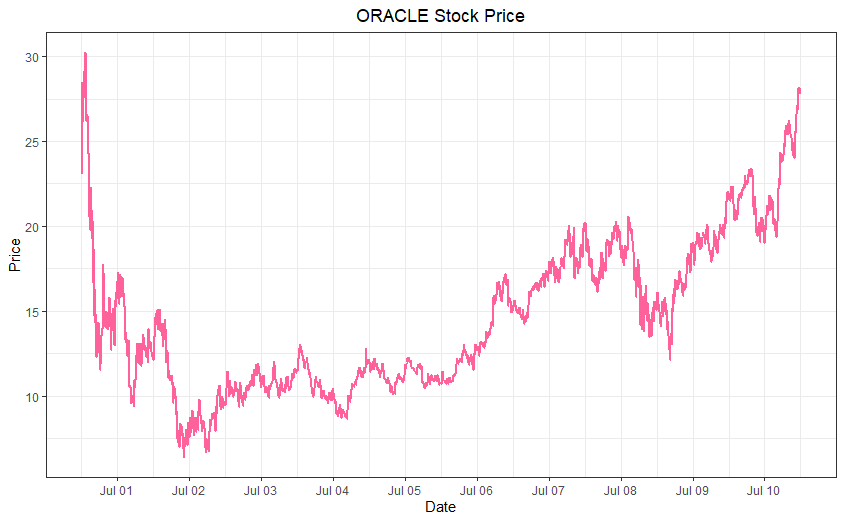

Although started in 1999, the world started identifying Salesforce as competitor of Oracle & SAP since 2002. Notice the slight fall in June 2002 on the Oracle’s chart
Drop in Oracle’s stock prices in 2004 has a correlation to the IPO launch of Salesforce.

Later, towards the end of 2008, Both Oracle & SAP announced new SAAS (cloud) platforms for Sales Management. Notice a drop in the Salesforce’ stock prices? 

## Cryptocurrency Bubble-
The Bitcoin prices started soaring in 2016 and the bubble, so to say, kind a popped by early 2018. From 2016 people started eyeing on cryptocurrencies like Bitcoin, Ethereum, Ripple, etc.
Blockchain is like Texas, and in Texas, everything’s bigger…even the losses. Even WebVan’s doomsday of $700 million daily losses don’t scrape the surface of some crypto’s biggest losers, such as Ripple’s $25 billion rainy day on Jan 8 this year. These fluctuations are a result of several factors: the access investors have to cryptocurrency and the massive availability of information via the internet. This creates a perfect storm for cryptocurrency volatility. 
Can you guess the effect of Bitcoin Bubble on IT Sector’s stocks? One assumes, there must be a correlation. But to my amazement, there wasn’t one.
Although, during 2016-2018, the microchip maker Nvidia had been among the best-performing names in the S&P 500 index of U.S. stocks. The stocks rose almost six-fold to over $210 a share. Why NVIDIA?
As the cryptocurrency popularity was growing, there was a generation of investors that found their hands on the amount of returns on mining those cryptocurrencies. Large warehouse was established and many took to mining cryptos full time. To fulfill the computer needs, heavy semiconductors and micro-chips are required. This led to a whooping demand for the semiconductor manufacturing industry. 

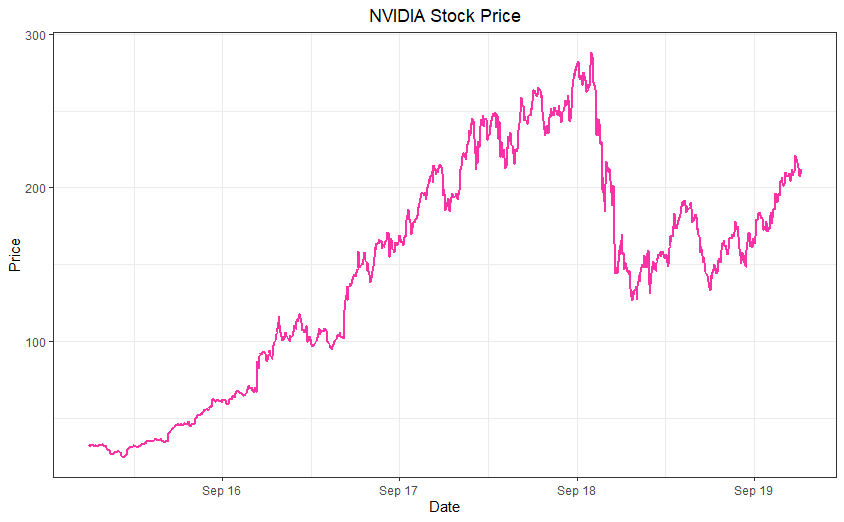

So, the above trend line speaks for most of the semiconductor manufacturing industries.
Times passed and lessons were learnt, while the investors are vigilant in the IT industry progressions, we can look at the forecasting techniques that can help determine the trend pattern better.

## Forecasting-
Let’s pick 2 performing companies to demonstrate the different techniques of forecasting-
Starting from Mean forecasting and progressing with Naïve forecasts, Seasonal Naïve, Naïve-Drift method to applying ARMIA model. 

### Forecasts for Apple
After performing the above listed methods of forecasting, we can determine the performance of the best method by measuring accuracy. According to the observation, the Naïve-Drift method gave the best results.

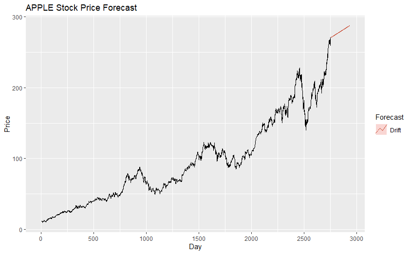

** We forecast the stock price of Apple for the next 180 days, and the model forecasts a maximum of $336.9141 and a minimum of $238.4553 as per 95% confidence interval using this model.**

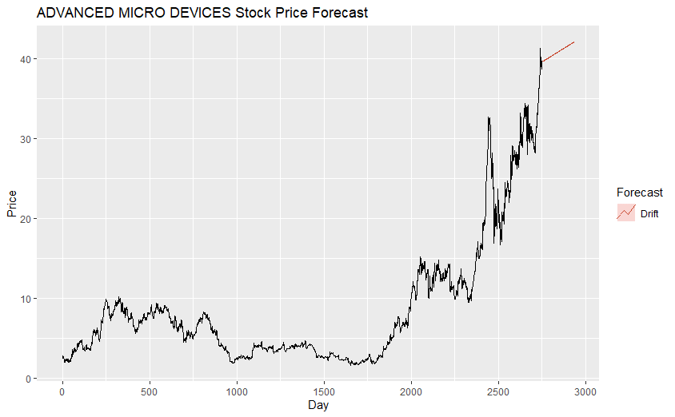

** Minimum stock price for 180 Days is forecasted to- $30.42352 and can reach a maximum price upto- $53.71107 according to 95% confidence interval.**

## Summary 
Our investors have learned from the dot-com crash. A decade ago, it was typical to invest in innovation alone
Today, Investors look for scalability, monetization and future product development roadmaps before making a decision. 

All these crashes have motivated the entire high-tech industry to invent new and better and more accessible technologies leading to market revolutions

** Take-Away :** New industries inevitably inspire surges in investments, but they also carry a significant burden of risk. While it may be clear that the industry as a whole will prevail in the long-term, it can be difficult to pinpoint exactly which companies will succeed along with it.

## Reference Links:
1.	https://www.barchart.com/stocks/indices/sp-sector/real-estate
2.	https://www.thinkadvisor.com/2008/12/01/the-crisis-in-a-nutshell/
3.	https://www.thinkadvisor.com/2008/12/01/the-crisis-in-a-nutshell/
4.	https://www.thinkadvisor.com/2008/12/01/the-crisis-in-a-nutshell/?slreturn=20191116143109
5.	https://www.brookings.edu/research/trends-in-the-information-technology-sector/

